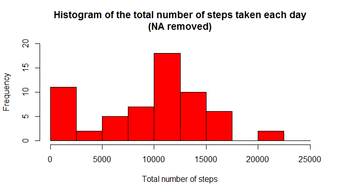
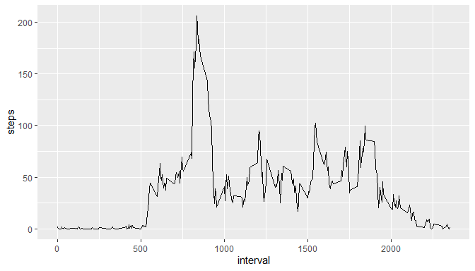
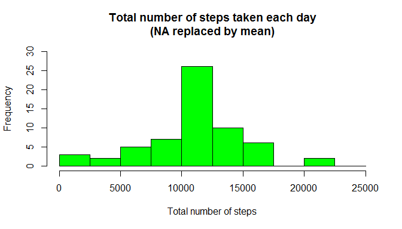
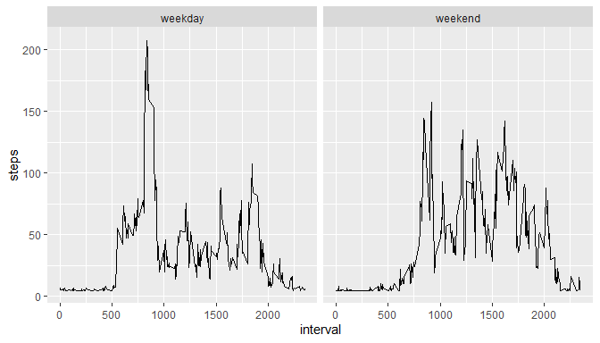

## Loading and preprocessing the data

# this is the file where the code will be updated

#this code is used for reading the data from the csv file activiy.csv


```r
data <- read.csv("activity.csv")
```
#we need to change the date format into date hence we write the code below

```r
data$date<-as.Date(data$date)
```
#next we need to creaate a histogram of the total number of steps taken each day

```r
sum_steps<-aggregate(data$steps,by=list(data$date),FUN=sum,na.rm=TRUE)
```


```r
hist(sum_steps$x, 
     breaks=seq(from=0, to=25000, by=2500),
     col="red", 
     xlab="Total number of steps", 
     ylim=c(0, 20), 
     main="Histogram of the total number of steps taken each day\n(NA removed)")
```

<!-- -->

#the next is we will calculate the mean and median steps taken each day

```r
mean(sum_steps$x)
```

```
## [1] 9354.23
```

```r
median(sum_steps$x)
```

```
## [1] 10395
```
#next we will create a time series plot of the average number of steps taken

```r
avg_steps<-aggregate(data$steps,by=list(data$interval),FUN=mean,na.rm=TRUE)

colnames(avg_steps)<-c("interval","steps")

library(ggplot2)
```

```
## Warning: package 'ggplot2' was built under R version 3.6.3
```


```r
ggplot(aes(x=interval,y=steps),data=avg_steps)+geom_line()
```

<!-- -->
#now we calculate the five minute intervals that on average that every step contains

```r
avg_steps[avg_steps$steps==max(avg_steps$steps),1]
```

```
## [1] 835
```

## Imputing missing values
#next we describe the steps for inputting the data
#first we calculate and report the number of missing values in the data


```r
sum(is.na(data$steps))
```

```
## [1] 2304
```
#replace NA with the means of the steps

```r
data$steps[is.na(data$steps)]<-mean(data$steps,na.rm=TRUE)
```
#this is the head of the new data set

```r
head(data)
```

```
##     steps       date interval
## 1 37.3826 2012-10-01        0
## 2 37.3826 2012-10-01        5
## 3 37.3826 2012-10-01       10
## 4 37.3826 2012-10-01       15
## 5 37.3826 2012-10-01       20
## 6 37.3826 2012-10-01       25
```
#now we create a histogram with the replaced NA values

```r
sum_steps<-aggregate(data$steps,by=list(data$date),FUN=sum,na.rm=TRUE) 
```


```r
hist(sum_steps$x, 
     breaks=seq(from=0, to=25000, by=2500),
     col="green", 
     xlab="Total number of steps", 
     ylim=c(0, 30), 
     main="Total number of steps taken each day\n(NA replaced by mean)")
```

<!-- -->

## What is mean total number of steps taken per day?

```r
mean(sum_steps$x)
```

```
## [1] 10766.19
```

```r
median(sum_steps$x)
```

```
## [1] 10766.19
```

#now we create Panel plot comparing the average number of steps taken per 5-minute interval across weekdays and weekends

# Convert date into weekdays


```r
data$days=tolower(weekdays(data$date))
```
#Now categorised days into weekend and weekdays

```r
data$day_type<-ifelse(data$days=="saturday"|data$days=="sunday","weekend","weekday")
```
#Take mean steps taken on weekend or weekday in the intervals

```r
avg_steps<-aggregate(data$steps,by=list(data$interval,data$day_type),FUN=mean,na.rm=TRUE)

colnames(avg_steps)<-c("interval","day_type","steps")
```

## Are there differences in activity patterns between weekdays and weekends?
# Create panel plot between average steps and interval seperated by day type


```r
ggplot(aes(x=interval,y=steps),data=avg_steps)+geom_line()+facet_wrap(~avg_steps$day_type)
```

<!-- -->
